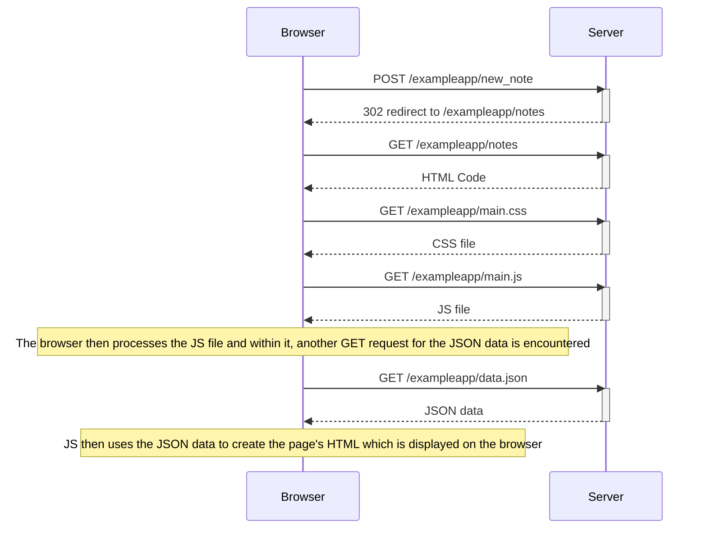

```mermaid
sequenceDiagram
    participant Browser
    participant Server

    Browser->>Server: POST /exampleapp/new_note
    activate Server
    Server-->>Browser: 302 redirect to /exampleapp/notes
    deactivate Server

    Browser->>Server: GET /exampleapp/notes
    activate Server
    Server-->>Browser: HTML Code
    deactivate Server

    Browser->>Server: GET /exampleapp/main.css
    activate Server
    Server-->>Browser: CSS file
    deactivate Server

    Browser->>Server: GET /exampleapp/main.js
    activate Server
    Server-->>Browser: JS file
    deactivate Server
    Note over Browser: The browser then processes the JS file and within it, another GET request for the JSON data is encountered

    Browser->>Server: GET /exampleapp/data.json
    activate Server
    Server-->>Browser: JSON data
    deactivate Server
    Note over Browser: JS then uses the JSON data to create the page's HTML which is displayed on the browser

    
```