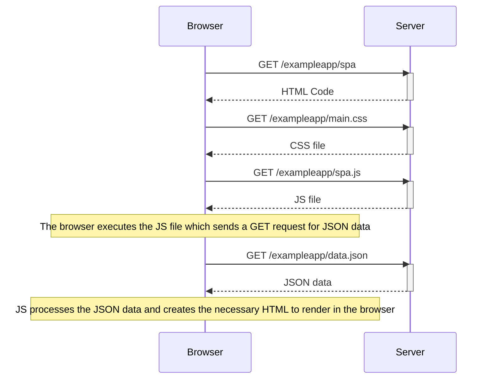

```mermaid
sequenceDiagram
    participant Browser
    participant Server

    Browser->>Server: GET /exampleapp/spa
    activate Server
    Server-->>Browser: HTML Code
    deactivate Server

    Browser->>Server: GET /exampleapp/main.css
    activate Server
    Server-->>Browser: CSS file
    deactivate Server

    Browser->>Server: GET /exampleapp/spa.js
    activate Server
    Server-->>Browser: JS file
    deactivate Server
    Note over Browser: The browser executes the JS file which sends a GET request for JSON data

    Browser->>Server: GET /exampleapp/data.json
    activate Server
    Server-->>Browser: JSON data
    deactivate Server

    Note over Browser: JS processes the JSON data and creates the necessary HTML to render in the browser


```