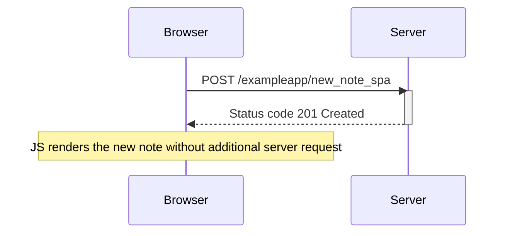

```mermaid
sequenceDiagram
    participant Browser
    participant Server

    Browser->>Server: POST /exampleapp/new_note_spa
    activate Server
    Server-->>Browser: Status code 201 Created
    deactivate Server
    Note over Browser: JS renders the new note without additional server request 
```